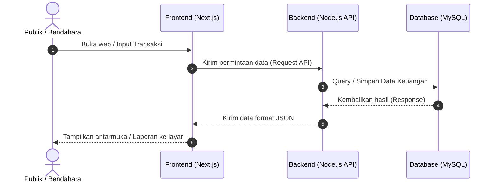
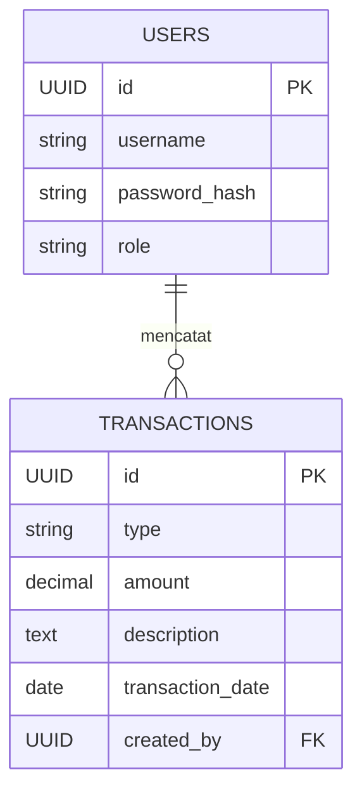

# PRD — Project Requirements Document

## 1. Overview
Aplikasi Laporan Keuangan DKM Al-Aena adalah sebuah platform berbasis web yang dirancang untuk mendigitalisasi pencatatan arus kas masjid (pemasukan dan pengeluaran). Saat ini, transparansi dan pengelolaan laporan keuangan masjid seringkali menjadi tantangan. Aplikasi ini bertujuan untuk memudahkan Bendahara dalam mencatat transaksi harian, memudahkan Ketua DKM dalam memonitor keuangan, serta memberikan transparansi penuh kepada Jamaah (publik) terkait dana umat secara seketika (real-time). 

## 2. Requirements
- **Akses Pengguna:** Sistem harus mendukung 3 jenis akses, yaitu Bendahara (input data), Ketua (pemantauan), dan Publik (hanya lihat).
- **Pencatatan Sederhana:** Tidak memerlukan kategori yang rumit; transaksi cukup dicatat berdasarkan nominal, jenis (debit/kredit), dan deskripsi teks.
- **Transparansi:** Publik harus dapat mengakses laporan tanpa perlu login.
- **Tanpa Proses Persetujuan (Approval):** Data yang dimasukkan oleh Bendahara akan langsung tampil pada laporan (Direct Approval).
- **Ekspor Laporan:** Laporan bulanan harus bisa diunduh oleh pengurus atau publik dalam bentuk dokumen digital.
- **Keamanan & Pencadangan:** Sistem harus memiliki fitur pencadangan data (backup) secara rutin setiap bulan.

## 3. Core Features
- **Dashboard Keuangan:** Halaman utama yang menampilkan ringkasan saldo saat ini, total pemasukan bulanan, total pengeluaran bulanan, dan grafik sederhana arus kas.
- **Manajemen Transaksi (Khusus Bendahara):** Formulir untuk menambah, mengedit, atau menghapus catatan pemasukan (debit) dan pengeluaran (kredit) dengan kolom deskripsi kegiatan.
- **Portal Akses Publik:** Halaman khusus yang bisa diakses siapa saja melalui tautan/URL untuk melihat riwayat uang masuk dan keluar DKM Al-Aena.
- **Generator Laporan (Export Data):** Fitur untuk memfilter laporan berdasarkan bulan/tahun dan mengunduhnya ke dalam format **PDF** (untuk dicetak/dibagikan) atau **CSV** (untuk diolah di Excel).
- **Sistem Autentikasi:** Halaman login khusus untuk Ketua dan Bendahara agar keamanan data terjaga.

## 4. User Flow
- **Alur Publik (Jamaah):**
  1. Pengguna membuka URL situs web.
  2. Disajikan Dashboard Laporan Keuangan bulan berjalan.
  3. Pengguna memilih bulan/tahun yang ingin dilihat.
  4. Pengguna menekan tombol "Unduh PDF" jika ingin menyimpan laporan.
- **Alur Bendahara (Input Data):**
  1. Login ke dalam sistem.
  2. Masuk ke menu "Kelola Transaksi".
  3. Klik "Tambah Transaksi", pilih jenis (Pemasukan/Pengeluaran).
  4. Isi nominal dan deskripsi transaksi (misal: "Kotak Amal Jumat", "Bayar Listrik").
  5. Simpan. Saldo masjid otomatis diperbarui.

## 5. Architecture
Aplikasi ini akan menggunakan pendekatan *Client-Server* modern. Frontend (antarmuka pengguna) dan Backend (logika sistem) dipisahkan agar lebih rapi dan cepat. Karena akan diunggah (deploy) di Vercel, aplikasi akan dioptimalkan untuk berjalan pada arsitektur berbasis *serverless*.

## 6. Database Schema
Karena sistem ini dirancang sederhana dan tanpa kategori spesifik, kita hanya membutuhkan dua tabel utama: tabel Pengguna dan tabel Transaksi.

**Daftar Tabel Utama:**
1. **`users` (Pengguna):** Digunakan untuk data login pengurus DKM.
   - `id` (UUID): Identitas unik pengguna.
   - `username` (String): Nama akun untuk login.
   - `password_hash` (String): Kata sandi terenkripsi.
   - `role` (String/Enum): Jabatan pengguna (Bendahara, Ketua).
2. **`transactions` (Transaksi):** Digunakan untuk mencatat semua kas.
   - `id` (UUID): Identitas unik pelaporan.
   - `type` (String/Enum): Jenis transaksi (`DEBIT` untuk masuk, `KREDIT` untuk keluar).
   - `amount` (Decimal): Jumlah uang (contoh: 500000).
   - `description` (Text): Catatan atau penjelasan (menggantikan fungsi kategori).
   - `transaction_date` (Date): Tanggal kas dicatat.
   - `created_by` (UUID): Merujuk ke `id` pengurus yang mencatat data.

## 7. Tech Stack
Berikut adalah teknologi yang direkomendasikan dan disesuaikan dengan permintaan Anda:
- **Frontend:** Next.js (menggunakan React). Direkomendasikan menambah *Tailwind CSS* untuk desain yang cepat dan *shadcn/ui* untuk komponen siap pakai (seperti tabel dan tombol).
- **Backend:** Node.js. (Dapat diintegrasikan langsung menggunakan fitur *Next.js API Routes* agar lebih mudah di-hosting di Vercel secara bersamaan, atau menggunakan framework Express.js).
- **Database:** MySQL (Bisa menggunakan layanan penyedia MySQL berbasis cloud seperti PlanetScale, Aiven, atau TiDB agar mudah terhubung ke Vercel).
- **ORM / Query Builder:** Drizzle ORM atau Prisma (Untuk memudahkan Backend mengelola data di MySQL).
- **Ekspor Dokumen (Library):** `pdfmake` atau `jspdf` (untuk membuat PDF), dan `papaparse` (untuk membuat CSV).
- **Deployment & Hosting:** Vercel (Meng-hosting aplikasi Frontend dan Backend secara kesatuan, memberikan kemudahan pengaturan otomatis dan performa tinggi).